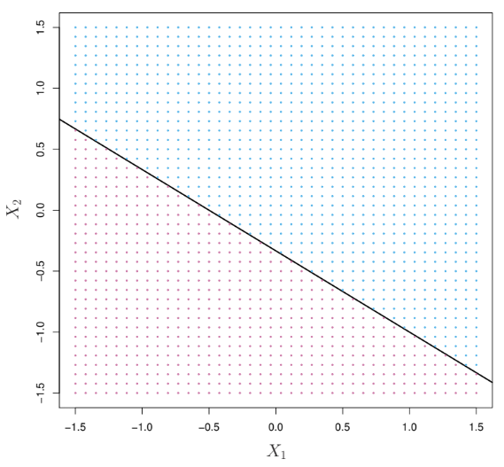
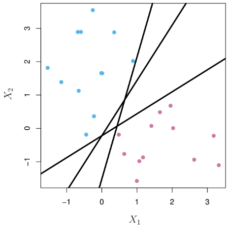
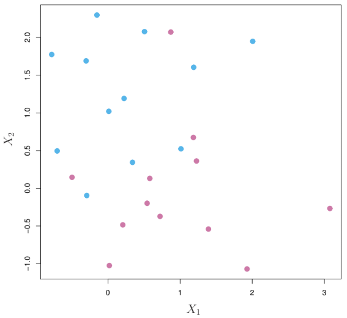
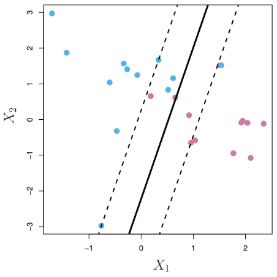
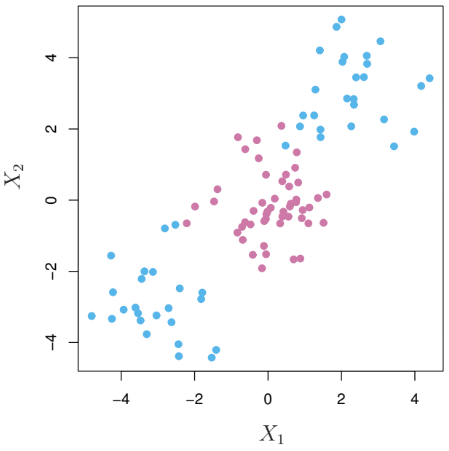
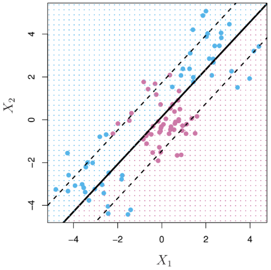
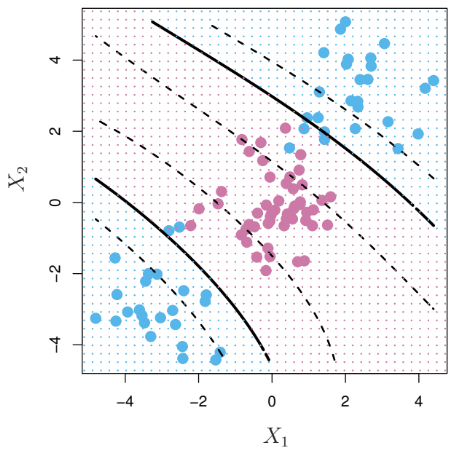
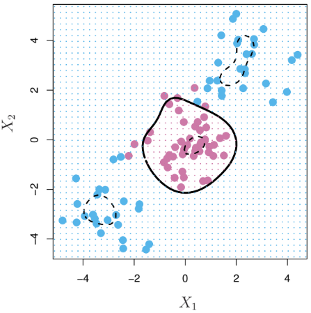

```{=html}
<style>
  body {
    font-size: 17px;
  }
</style>
```

# ¿Qué es?

Es una **técnica** de **aprendizaje supervisado** que sirve **para clasificar observaciones** en un data set y tiene el objetivo de predecir la clase (etiqueta) a la cual debe pertenecer una observación fuera del data set.

# ¿Cómo funciona?

Para asignar una etiqueta a cada observación, se desea

-   Dividir el espacio predictor en dos *(o más)* partes. Cada parte corresponderá a una etiqueta diferente de la variable respuesta $y$ que es categórica.

-   La división se hará con límites y márgenes.

    -   El cálculo de los límites y márgenes depende de una función llamada **Kernel**.

-   La construcción de los límites dependerá *de la forma* en que se encuentren las observaciones del data set.

-   Se elegirá un "costo" que definirá la tolerancia al error de clasificación.

# Lo matemático *(ideas)*

Sea $\mathbb{R}^{p+1}$ el espacio predictor *(un espacio vectorial de dimensión* $p$*)*, con $p \in \{1, 2, ...\}$ no infinito.

A un vector $x$ en $\mathbb{R}^{p+1}$ le llamaremos **observación** y es tal que $x := (x_1, x_2, ...., x_p, y)$ donde $y \in \{-1, 1\}$ representa **la variable respuesta**, que es categórica y sus etiquetas son dos: $-1, 1$. Las **variables explicativas** son $x_1, ..., x_p$.

Sea $n \in \mathbb{N}$. Decimos que **un dataset es** el conjunto $\{x_1, ..., x_n\}$ contenido en el espacio predictor.

Por ende, dada $i \in \{1, ..., n\}$, se tiene que

$$
x_i := (x_{i1}, x_{i2}, ..., x_{ip}, y_i) 
$$

Es posible que $x_i$ considere o no a la variable respuesta $y_i$.

## De lo simple a lo complejo

Supongamos $p = 2$. Consideremos la siguiente gráfica:

<div>
<p style = 'text-align:center;'>
{width='550px'}
</p>
</div>

Podemos observar que en los ejes tenemos las variables respuesta y el color distinto de los datos representa la etiqueta a la que pertenece dicha observación. Esto implica que cada observación bajo la linea es de una etiqueta y encima de otra.

Este es el caso más simple porque:

1.  Las observaciones se separan con una linea recta.

2.  Las observaciones se separan en conjuntos disjuntos (los rosas y los azules no se traslapan).

3.  Hay solo dos variables explicativas.

En general, no se tienen datasets tan simples y vamos a generalizar desde el úlimo *ceteris paribus*, hasta el primer punto.

## Dimensionalidad

Supongamos que ahora tenemos más de dos variables explicativas, $p$.. ¿Qué sería una línea recta cuando hay más de 2 variables explicativas? ¡Un hiperplano!

**Hiperplano.**

Definimos el hiperplano asociado al espacio predictor $\mathbb{R}^{p+1}$ como el conjunto$H := \{(x_1, x_2, ..., x_p) \in \mathbb{R}^p \space | \space \beta_0 + \beta_1x_1 + ...+ \beta_p x_p = 0\}$ donde $\forall i \in \{0, ..., p\}, \space \beta_i \in \mathbb{R}$.

Sea $f: \mathbb{R}^p \rightarrow \mathbb{R}$ la función no nula dada por $f(x) = \beta_0 + \beta_1x_1 + ...+ \beta_p x_p$.

Para culquier $x \in \mathbb{R}^p$ se tiene una y solo una de las siguientes opciones:

$$
f(x) > 0, \rightarrow x \notin H \\
f(x) = 0, \rightarrow x \in H \\
f(x) < 0, \rightarrow x \notin H
$$

Podemos arbitrariamente decir que si $f(x) > 0$ entonces designaremos su correspondiente variable respuesta $y = 1$. Análogo que si $f(x) < 0, \rightarrow y = -1$.

Cuando tenemos un dataset y encontramos al menos un hiperplano $H$ que cumple con tales características (más las 1 y 2), tal hiperplano es útil para clasificar.

Es decir que, dado un dataset de tamaño $n$, si sucede que $\forall i \in \{1, ..., n\}$

$$
y_if(x_i) > 0 
$$

entonces $H$ es un buen clasificador.

Como **no solo** nos interesa que **las observaciones de ese dataset** estén separadas (sino tener una buena predicción), nos gustaría que la distancia entre las observaciones de cada etiqueta y el hiperplano, sea la máxima posible.

Entonces, sea $d_i^{(1)}$ la distancia perpendicular de la observación $i$ al hiperplano cuando la observación tiene la etiqueta 1, esto es

$$
d_i^{(1)} := \frac{|f(x_i)|}{\sqrt{\beta_1^2 +  ... + \beta_p^2}}, y_i = 1
$$

Análogamente se define $d_i^{(-1)}$.

La distancia máxima del hiperplano "al dataset" es

$$
m_H := \max\{d_i^{(1)}\space|\space i = 1, ...,n\} + \max\{d_i^{(-1)}\space|\space i = 1, ...,n\}
$$

<div>
<p style = 'text-align:center;'>
{width='550px'}
</p>
</div>

Queremos encontar el hiperplano que consiga la mayor de las distancias entre este y el mismo data set. Entonces queremos

$$
M := \max\{m_H\space|\space H \text{ es hiperplano separador} \}
$$

Al hiperplano que cumple con esta característica se le conoce como Maximal Margin Classifier porque a $M$ se le llama **márgen**.

<div>
<p style = 'text-align:center;'>
{width='550px'}
</p>
</div>

## Traslape

Ya que tenemos más dimensiones, podemos ver el ejemplo cuando:

<div>
<p style = 'text-align:center;'>
{width='550px'}
</p>
</div>

Es claro que las observaciones no son separables por un hiperplano (que en este caso es una recta), por lo cual, si queremos clasificar con los datos que tenemos, tendremos que ser más flexibles.

El término $\epsilon_i$ es introducido para contar "los errores" en términos de distancia que "se pasa al otro lado del hiperplano". Nosotros podemos definir el costo que vamos a asumir por esos errores de clasificación $C$.

Dado que ya no puede ser que todas las observaciones en el dataset sean correctamente clasficadas, debemos tratar de maximizar el márgen a pesar del error que nosotros deseamos asumir ($C$ es un hiperparámetro).

Por último, el hiperplano tendrá márgenes paralelos que calcularemos para identificar que "las observaciones dentro de los márgenes/límites están en peligro de ser malclasificadas."

##### Problema de Optimización

El problema de optimización de forma matemática es el siguiente:

$$
\begin{align*}
\max\{ M \space | \space H, \epsilon_i\} \space & ... (1) \\
\sum_{j = 1} ^ p \beta_j^2 = 1 \space & ...(2) \\
y_if(x_i) \geq M(1-\epsilon_i) & \space ... (3) \\
\epsilon_i \geq 0, \sum_{i = 1} ^ n \epsilon_i \leq C \space &...(4)
\end{align*}
$$

Veamos el significado de cada parte del problema de optimización:

1.  Es la función objetivo, queremos maximizar el margen, es decir, seguir teniendo un hiperplano lo más lejos posible a ambas clases.
2.  Es una restricción para que se cumpla la definición de hiperplano ($f$ no puede ser nula)
3.  Nos gustaría que estén bien clasificadas las observaciones y además que no se pasen demasiado dentro de los límites que define el margen.
4.  Los errores de clasificación deben ser positivos y no deben superar nuestro deseo de mala clasificación.

En el ejemplo de aplicación podremos ver que a mayor costo, menor margen y por ende, mayor error de clasificación.

<div>
<p style = 'text-align:center;'>
{width='550px'}
</p>
</div>

A este hiperplano con sus márgenes se le llama Support Vector Classifier.

**Los vectores soporte** son squellas observaciones del data set que quedan en el borde de los límites, es decir, de las líneas punteadas.

## Límites no lineales

Ahora que adminitmos más dimensiones y posibles errores de clasificación, consideremos la siguiente gráfica:

<div>
<p style = 'text-align:center;'>
{width='550px'}
</p>
</div>

Podemos notar que una línea recta no funcionaría para hacer la clasificación. Es decir que la forma que tienen nuestros datos no nos permite considerar UN hiperplano apriori. Tenemos entonces la necesidad de introducir otro concepto llamado **Kernel**.

De la gráfica podemos rescatar que no es posible separar los datos por medio de un hiperplano asociado a este espacio de dimensión 2. Pero ¿Qué tal que en otro espacio, tales observaciones sí sean separables por un hiperplano asociado a una dimensión mayor?

Para entender la idea anterior considera estas gráficas:

-   **Dimensión** $p = 1$, es decir que solo hay una variable explicativa.

    <div>
    <p style = 'text-align:center;'>
    {width='550px'}
    </p>
    </div>

-   **Dimensión** $p = 2$, es decir que hay dos variables explicativas.

    <div>
    <p style = 'text-align:center;'>
    {width='550px'}
    </p>
    </div>

En ambos casos se tomaron los datos que estaban en una dimensión (1 ó 2), se transformaron y se "añadió una dimensión" en la que las observaciones sí fueran separables por un hiperplano.

La pregunta sería ¿Cómo se añade una dimensión más que permita tal separación? Pues la respuesta es: usa una función que "levante" las observaciones de una clase y "baje/deje igual" a las observaciones de otra clase. Esta función se llama **kernel.**

### Kernel

Sea $\phi: \mathbb{R}^p \rightarrow \mathbb{R}^r$ donde $r>p$. Decimos que $K: \mathbb{R}^{2p} \rightarrow \mathbb{R}$ es un **kernel** asociado a $\phi$ si $\forall x, x^* \in \mathbb{R}^p$ se tiene que

$$
K(x, x^*) = \phi(x)^T \phi(x^*) 
$$

Es decir que la función kernel, asigna un valor que relaciona dos vectores. Esta relación entre los vectores se hace en un espacio *vectorial* de dimensión mayor en el que suponemos que se puede hacer la "división de las clases de forma lineal".

### Ejemplos de funciones kernel

Existen funciones kernel famosas por su aplicación. Porque tales funciones permiten que los límites entre las clases de observaciones, sean "flexibles".

-   Asociado al problema de Support Vector Classifier (el lineal).

    $$
    K(x_i, x_j) = \sum_{l = 1}^p x_{il}x_{jl}
    $$

    <div>
    <p style = 'text-align:center;'>
    {width='550px'}
    </p>
    </div>

-   Polinomial *de grado* $d$

    $$
    K(x_i, x_j) = \bigg( 1 + \sum_{l = 1}^p x_{il}x_{jl}\bigg)^d
    $$

    <div>
    <p style = 'text-align:center;'>
    {width='550px'}
    </p>
    </div>

-   Radial

    $$
    K(x_i, x_j) = \exp \bigg\{ -\gamma \sum_{l = 1}^p (x_{il} - x_{jl})^2\bigg\}
    $$

    <div>
    <p style = 'text-align:center;'>
    {width='550px'}
    </p>
    </div>

Con este concepto podremos saber la forma general y simplificada del funcionamiento de una Máquina de Soporte Vectorial (Support Vector Machine SVM).

¿Cómo se usa el kernel en las SVM?

-   Recordemos primero que consideramos una función $f$ de la siguiente forma

    $$
    f(x) =  \beta_0 + \beta_1x_1 + ...+ \beta_p x_p := \beta_0 + \beta \cdot x $$

    Donde $\beta = (\beta_1, ..., \beta_p)$ y $\cdot$ es el producto punto/interior.

-   La anterior, pero en el contexto de dataset (es decir teniendo datos), se puede escribir como:

    $$
    f(x) = \beta_0 + \sum_{i = 1} ^ n \alpha_i \langle x, x_i\rangle
    $$

    donde $\langle x_i, x_j\rangle :=\displaystyle \sum_{l = i}^p x_{il}x_{jl}$ *(producto interno)* y $\alpha_i$ son parámetros a estimar. Los vectores que no son vectores soporte tienen valores de $\alpha = 0$ por lo cual, dado $S$ el conjunto de indices de las observaciones en el dataset que son vectores soporte, tenemos que:

    $$
    f(x) = \beta_0 + \sum_{i \in S} \alpha_i \langle x, x_i\rangle
    $$

-   Para construir una SVM, se plantea la función como:

    $$
    f(x) = \beta_0 + \sum_{i \in S} \alpha_i K(x, x_i)
    $$

Y lo anterior se contempla en el [problema de optimización] previamente planteado.

Ahora veamos cómo se puede usar esta técnica en la computadora:

# [Aplicación en R](https://carlos-arguello.shinyapps.io/Tutorial_SVM/)

### Referencias

-   [An Introduccion to Statistical Learning](https://www.dropbox.com/s/krvhmt7z8zxhl7f/ISLRv2_website.pdf?dl=0) with Applications in R. Second Edition.

-   [Datacamp Course. Support Vector Machine in R](https://learn.datacamp.com/courses/support-vector-machines-in-r).

-   [RDocumentation](https://www.rdocumentation.org/packages/e1071/versions/1.7-8). `e1071.`

-   [Métodos Kernel para clasificación](https://gtas.unican.es/files/docencia/APS/apuntes/07_svm_kernel.pdf). Universidad de Cantabria.

-   [Support Vector Regression: propiedades y aplicaciones](https://idus.us.es/bitstream/handle/11441/43808/Mart%C3%ADn%20Guare%C3%B1o%2C%20Juan%20Jos%C3%A9%20TFG.pdf?sequence=1&isAllowed=y). Universidad de Sevilla

### Contáctame

🦜[Twitter](https://twitter.com/CarlosAAr6)

💻[Github](https://github.com/CarlosA-Ar/SVM-con-R)
