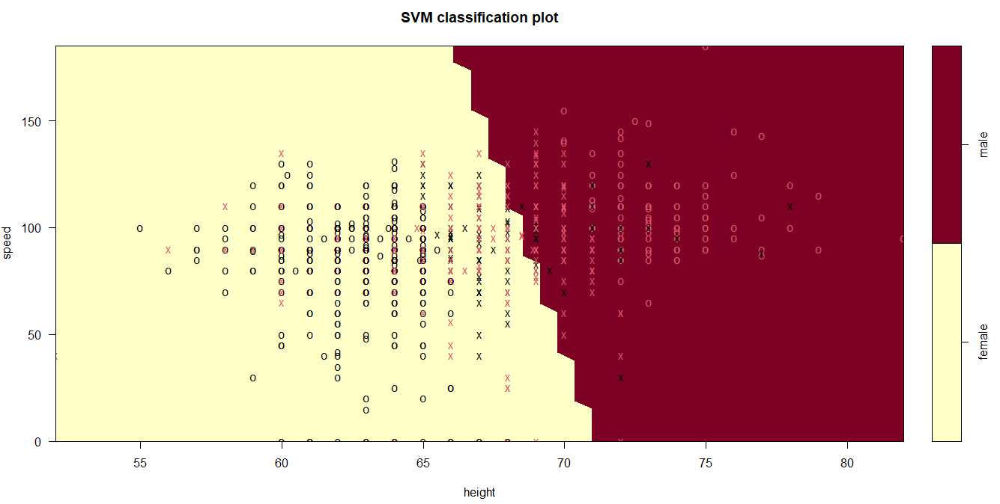
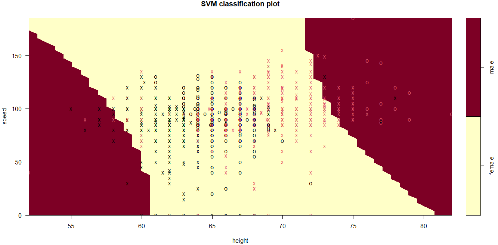
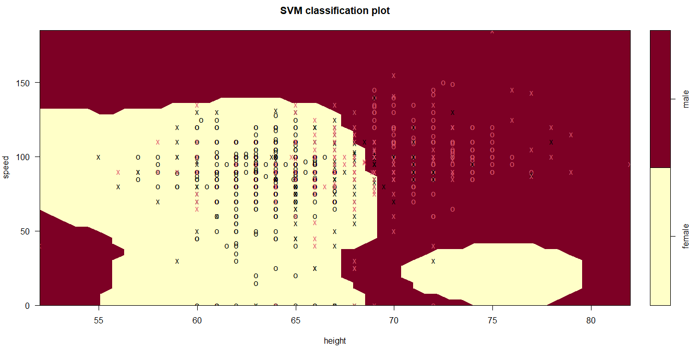

```{=html}
<style>
div {
  text-align: justify;
}
/***********************/
/*Títulos ## y autoría F6EACD*/
/***********************/
h1, h2 {
  color: #6D4101;
  padding: .4em; /*es decir el 60 por ciento del tamaño de la letra*/
  font-family: "Courier New", monospace;
  font-size: 35px;
  font-weight: bold;
  opacity: 0.95;
}
em {
  color: #8A6C0C;
  font-family: "Courier New", monospace;
  font-size: 18px;
  padding: .2em;
  opacity: 0.97;
  font-weight: bold;
}
/***********************/
/* Cuerpo */
/***********************/
body {
  font-family: Verdana, Helvetica, sans-serif;
  font-size: 16;
  background-color: #EEF5F9;
  color: #000000;
}
/***********************/
/* Títulos con ###     */
/***********************/
h3, h4, h5{
  color: #06116C;
  font-family: Verdana, Helvetica, sans-serif;
}
/*******************************************/
/* Referencias a páginas o a otro documento*/
/*******************************************/
a {
    color: #B8870F;
    text-decoration: none;
}
/**********************/
/* Chunks de exercises*/
/**********************/
.ace-tm {
    background-color: #FFFEF7;
    color: #010730;
}
/***********************/
/* tabla de contenidos */
/***********************/
.topicsList {
  padding: .5em;
}
.topicsHeader {
  color: #06116C;
  padding: .5em;
}
.topicsList #doc-metadata {
  color: #06116C;
  padding: .5em;
}
.topicsList .topic.current {
  background-color: #8A6C0C;
  color: #FFFFFF;
  font-weight: bold;
}
.topicsList .topic:hover, .topicsList .topic:active {
  background-color: #E0CD4E;
  color: #01053D;
}
/***********/
/* Botones */
/***********/
.btn {
  background-color: #000857;
  color: #EBEDFF;
}
/* cambiar de página */
.btn-default {
    color: #EBEDFF;
    background-color: #000857;
    border: none;
}
/* cambiar de página */
.btn-light {
  background-color: #000857;
  color: #EBEDFF;
}
/* run code */
.btn-primary , .btn-success, .btn-info{
  background-color: #786300;
  color: #EBEDFF;
}
/* mientras está desabilitados */
.btn:hover, .btn:active, .btn:disabled {
  background-color: #786300;
  color: #EBEDFF;
}
/**********/
/* Código */
/**********/
code {
    color: #6D4101;
    background-color:  #F7FBF9;
    font-size: 15px;
    font-weight: bold;
}
/**************************/
/* Recuadro para ejemplos */
/**************************/
.boxed {
    background: #F7FBF9;
    color: black;
    border: 3px solid #C83737;
    margin: 0px auto;
    width: 456px;
    padding: 10px;
    border-radius: 10px;
  }
.note {
    padding: 1em;
    margin: 1em 0;
    padding-left: 100px;
    background-size: 70px;
    background-repeat: no-repeat;
    background-position: 15px 15px;
    min-height: 120px;
    color: black;
    background-color: lightgrey;
    border: solid 5px #C83737;
    background-image: url("manzana.png");
  }
.note_white {
    padding: 1em;
    margin: 1em 0;
    padding-left: 100px;
    background-size: 70px;
    background-repeat: no-repeat;
    background-position: 15px 15px;
    min-height: 120px;
    color: black;
    background-color: #F7FBF9;
    border: solid 5px #C83737;
    background-image: url("manzana.png");
  }
</style>
```

```{r setup, include=FALSE}
#Librerías a usar

  #Hacer el tutorial
  library(learnr)
  #Hacer los modelos de SVM
  library(e1071)
  #Hacer gráficas bonitas y acomodadas
  library(ggplot2)
  library(gridExtra)
  #Leer los archivos csv
  library(readxl)
  #Manejar los archivos
  library(dplyr)

#Modificaciónes para los chunks
knitr::opts_chunk$set(echo = FALSE, fig.align ='center')

```

```{r datas}
info <- read.csv("https://raw.githubusercontent.com/CarlosA-Ar/SVM-con-R/main/csvs/info.csv")
```

```{r datasL}
# Cargar datos y "limpiarlos"
info <- read.csv("https://raw.githubusercontent.com/CarlosA-Ar/SVM-con-R/main/csvs/info.csv")
trainset <- read.csv("https://raw.githubusercontent.com/CarlosA-Ar/SVM-con-R/main/csvs/trainset.csv")
testset <- read.csv("https://raw.githubusercontent.com/CarlosA-Ar/SVM-con-R/main/csvs/testset.csv")

set.seed(1)
# Construir modelos (ver lo que se obtiene + una gráfica y un accuracy)

## Lineal
svm_model_l <- svm(gender ~ ., 
                data = trainset, 
                type = "C-classification", 
                kernel = "linear", 
                scale = FALSE)

# Graficar los datos
plot_info <- ggplot(info, aes(x = speed, y = height, color = gender)) + geom_point() + ggtitle("Personal Information")+ theme_minimal() + scale_color_manual(values = c("#BD9B17", "#1A1458"))

w <- t(svm_model_l$coefs) %*% svm_model_l$SV
slope_l <- -w[1]/w[2]
intercerpt_l <- svm_model_l$rho / w[2]
```

```{r datasP}
set.seed(1)
# Este es prácticamente todo lo que desarrollaremos en el tutorial, de aquí 
# tomaremos los objetos.

# Cargar datos y "limpiarlos"
info <- read.csv("https://raw.githubusercontent.com/CarlosA-Ar/SVM-con-R/main/csvs/speed_gender_height.csv")
info <- info[, -1]
info$gender <- as.factor(info$gender)
info <- na.omit(info)

# Separar datos
# 80% para construir el modelo, 20% para "probar su capacidad de predecir"
info[, "train"] <- ifelse(runif(nrow(info)) < .8, 1, 0)
trainset <- info[info$train == 1, ]
testset <- info[info$train == 0, ]

trainColNum <- grep("train", names(info))
trainset <- trainset[, -trainColNum]
testset <- testset[, -trainColNum]

set.seed(1)
## Polinomial: con la función tune
tune_out_p <- 
  tune.svm(
    x = trainset[, -2], y = trainset[, 2],
    type = "C-classification",
    kernel = "polynomial", degree = c(2,3),
    cost = 10^(-1:1),
    gamma = c(0.1, 1)
    )

svm_model_p <- svm(gender ~ ., 
                data = trainset, 
                type = "C-classification", 
                kernel = "polynomial", degree = 2,
                cost = tune_out_p$best.parameters$cost,
                gamma = tune_out_p$best.parameters$gamma)
```

```{r datasR}
set.seed(1)
# Este es prácticamente todo lo que desarrollaremos en el tutorial, de aquí 
# tomaremos los objetos.

# Cargar datos y "limpiarlos"
info <- read.csv("https://raw.githubusercontent.com/CarlosA-Ar/SVM-con-R/main/csvs/speed_gender_height.csv")
info <- info[, -1]
info$gender <- as.factor(info$gender)
info <- na.omit(info)

# Separar datos
# 80% para construir el modelo, 20% para "probar su capacidad de predecir"
info[, "train"] <- ifelse(runif(nrow(info)) < .8, 1, 0)
trainset <- info[info$train == 1, ]
testset <- info[info$train == 0, ]

trainColNum <- grep("train", names(info))
trainset <- trainset[, -trainColNum]
testset <- testset[, -trainColNum]

set.seed(1)
## Radial: con la función tune.
tune_out_r <- 
  tune.svm(
    x = trainset[, -2], y = trainset[, 2],
    type = "C-classification",
    kernel = "radial",
    gamma = 10^(-1:2),
    cost = c(0.01, 0.1, 1, 10)
    )
```

## Introducción

### Objetivo

Que aprendas las bases sobre la función `svm()` de la librería `e1071`. Esta función permite implementar la técnica de clásificación _Support Vector Machines_ en datasets. Si quieres conocer algunas ideas teóricas de esta técnica _SVM_, constulta este [breve artículo](https://maquinas-de-soporte-vectorial.netlify.app/).

El tutorial usará un dataset como medio de aplicación de esta técnica reciente (inicios en 1990). Veremos algunas formas de graficar los resultados con `ggplot2` y podrás cambiar los parámetros de `svm()` para explorar resultados. 

### Cargar librería

Para poder hacer uso de la función `svm()`, es primordial cargar la librería `e1071`, puedes hacerlo en el siguiente espacio de código.

```{r ej1, exercise=TRUE}
# Cargar la librería
library(____)
```

### Parámetros de svm()

Como se ve en la teoría, debemos considerar una variable respuesta que sea categórica y tenga dos etiquetas (al menos).

En un objeto de tipo `data.frame` guardamos los datos: renglones/observaciones, columnas/variables(v).

- `formula`: v.respuesta ~ v.explicativas

- `data`: data.frame

- `scale`: ¿Se escalan los datos? Verdadero (T) o Falso (F)

- `type`: "C-classification" por defecto. Permite hacer que la SVM clasifique las observaciones, según v.respuesta.

- `kernel`: tipo de kernel. Puede tomar los siguientes valores:

    - "linear": $K(x_i, x_j) =\displaystyle \sum_{l = 1}^p x_{il}x_{jl}$
    
    - "polynomial": $K(x_i, x_j) = \bigg( 1 + \displaystyle \sum_{l = 1}^p x_{il}x_{jl}\bigg)^d$
    
    - "radial": $K(x_i, x_j) = \exp \bigg\{ -\gamma \displaystyle \sum_{l = 1}^p (x_{il} - x_{jl})^2\bigg\}$

- `cost`: 1, por defecto. Es la $C$ del [problema de optimización](https://maquinas-de-soporte-vectorial.netlify.app/#problema%20de%20optimizaci%C3%B3n).

Ve más parámetros de la función en la [documentación de R](https://www.rdocumentation.org/packages/e1071/versions/1.7-8).

## ¿Confirmando estereotipos?

En esta sección consideremos el dataset siguiente:

### Forma de los datos

- __speed_gender_height__: Velocidad, género y altura de 1302 estudiantes.

    Son 1302 observaciones, la variable respuesta tiene las etiquetas "female" y "male" de la variable categórica $y =$ gender.
    
    Las variables explicativas son "height" y "speed" de las personas participantes en el estudio.
    
<div>
<p style = 'text-align:center;'>
{width='350px'}
</p>
</div>

En el siguiente código puedes explorar de visualmente la forma en que se acomodan las observaciones en el data set popcorn.

__Nota:__ el parámetro `alpha` (que puede tomar cualquier valor 0 y 1) en la una función de `ggplot2` nos dice qué tan "transparentes" se colorearán los puntos. Si `alpha = 1` entonces no es transparente.

```{r pl1, exercise = TRUE, exercise.setup = "datas"}
plot_info <- ggplot(info, aes(x = speed, y = height, color = gender)) + 
  geom_point(alpha = ___) + 
  ggtitle("Personal Information") + 
  theme_minimal() + 
  scale_color_manual(values = c("#BD9B17", "#1A1458"))

plot_info
```

Notemos que hay traslape pero parece ser una separación "lineal".

## Separar datos

Para poder comprobar la utilidad de nuestro modelo, es común hacer que el conjuntos de datos se parta en dos (inicialmente...): 

- __trainingset__ para construir el modelo) y 

- __testset__ para hacer las predicciones y poner a prueba el poder de predicción del modelo.

En este ejercicio usaremos el dataset info para partir los datos en dos conjuntos.

```{r ej2, exercise = TRUE, exercise.setup = "datas"}
# 80% para construir el modelo, 20% para "probar su capacidad de predecir"
info[, "train"] <- ifelse(runif(nrow(info)) < .8, 1, 0)
trainset <- info[info$train == 1, ]
testset <- info[info$train == 0, ]

trainColNum <- grep("train", names(info))
trainset <- trainset[, -trainColNum]
testset <- testset[, -trainColNum]

length(testset$gender)
```

## Crear modelo

En este capítulo construiremos el modelo con los datos que ya exploramos. Los ejercicios se dividen según se desea cambiar el kernel.

### Lineal

$$K(x_i, x_j) =\displaystyle \sum_{l = 1}^p x_{il}x_{jl}$$
Ajusta un SVM con un kernel lineal a los datos `info`.

```{r ej3, exercise = TRUE, exercise.setup = "datasL"}
svm_model_l <- svm(gender ~ ., 
                data = trainset, 
                type = "C-classification", 
                kernel = "____", 
                scale = FALSE)
```

Revisemos algunos elementos que nos devuelve el modelo

```{r ej4, exercise = TRUE, exercise.setup = "datasL"}
names(svm_model_l) # ¿Qué nos devuelve el modelo?
svm_model_l$index # ¿Cuáles observaciones son vectores soporte?
svm_model_l$rho # Beta0 (intercepto)
```

Obtengamos la pendiente y ordenada al origen del hiperplano (recta, para las amistades). Recordemos que si 

$$
\beta_0 + \beta_1 x_1 + \beta_2 x_2 = 0 \rightarrow x_2 = \frac{-\beta_1}{\beta_2} x_1 + \frac{-\beta_0}{\beta_2}
$$

```{r ej5, exercise = TRUE, exercise.setup = "datasL"}
# Vector de pesos
w <- t(svm_model_l$coefs) %*% svm_model_l$SV
#Pendiente
slope_l <- -w[1]/w[2]
#Ordenada al origen
intercerpt_l <- svm_model_l$rho / w[2]
```

Hagamos un gráfico de los datos con el hiperplano y los márgenes

```{r ej6, exercise = TRUE, exercise.setup = "datasL", exercise.lines = 21}
plot_info_svm_l <-  plot_info + 
  # resaltamos los vectores soporte
  geom_point(data = trainset[svm_model_l$____,],
             aes(x = speed, y = height),
             color = "#6EA815", size = 2, alpha = .3) +
  # añadimos el hiperplano
  geom_abline(slope = slope_l,
              intercept = ______,
              size = 1,
              color = "#A91323") + 
  # con sus lineas paralelas con el margen correspondiente
  geom_abline(slope = slope_l, 
              intercept = intercerpt_l - 1/w[2],
              linetype = "dashed",
              color = "#A91323") +
  geom_abline(slope = slope_l, 
              intercept = intercerpt_l + 1/w[2],
              linetype = "dashed",
              color = "#A91323")

plot_info_svm_l
```

¿Qué tan bien hizo la clasificación?

```{r ejextr, exercise = TRUE, exercise.setup = "datasL"}
pred_test_1 <- predict(svm_model_l, testset)
mean(pred_test_1 == testset$gender) #accuracy
plot(svm_model_l, trainset)
```


### Polinomial

$$K(x_i, x_j) = \bigg( 1 + \displaystyle \sum_{l = 1}^p x_{il}x_{jl}\bigg)^d$$
Recordemos que existen diversos hiperparámetros, parámetros que nosotros decidimos. Para no hacer una elección al azar, la función `tune.svm()` nos permite elegir "los mejores" de entre la lista que demos.

Esto lo hace buscando el modelo que mejores aciertos tenga de predicción, o menor error, de entre todas las combinaciones posibles.

```{r ej7, exercise = TRUE, exercise.setup = "datasP"}
tune_out_p <- 
  tune.svm(
    #en vez del data set, y la fórmula, se escriben la respuesta y
    #las variables explicativas
    x = trainset[, -2], y = trainset[, 2],
    type = "C-classification",
    kernel = "_____", degree = 2,
    #Damos diferentes valores para los parámetros
    cost = 10^(-1:1),
    gamma = c(0.1, 1)
    )
tune_out_p
```

Una vez hecho lo anterior, podemos construir nuestro modelo

```{r ej8, exercise = TRUE, exercise.setup = "datasP"}

#Obtenemos los "mejores" valores de hiperaprámetros
c <- tune_out_p$best.parameters$cost
gma <- tune_out_p$best.parameters$gamma
d <- tune_out_p$best.parameters$degree

svm_model_p <- svm(gender ~ ., 
                data = ____, 
                type = "C-classification", 
                kernel = "polynomial", degree = d,
                cost = c,
                gamma = gma)

# ¿Cuántas de las observaciones son vectores soporte?
length(svm_model_p$index) 
```

Por último veamos la exactitud de predicción del modelo (accuracy) así como el plot que nos brinda `e1071` por defecto.

```{r ej9, exercise = TRUE, exercise.setup = "datasP"}
pred_test_p <- predict(svm_model_p, testset)
mean(pred_test_p == testset$gender) #accuracy

plot(svm_model_p, trainset)
```

### Radial

$$K(x_i, x_j) = \exp \bigg\{ -\gamma \displaystyle \sum_{l = 1}^p (x_{il} - x_{jl})^2\bigg\}$$
Como en el ejerciicio anterior, he buscado los "mejores" hiperparámetros. Ahora solo te toca obtener el modelo, ver su exactitud de predicción y graficar.

Considera que en este ejercicio el objetivo es que uses un kernel radial.

```{r ej10, exercise = TRUE, exercise.setup = "datasR"}
svm_model_r <- svm(____ ~ ., 
                data = trainset, 
                type = "C-classification", 
                kernel = "____",
                cost = tune_out_r$best.parameters$___,
                gamma = tune_out_r$____$gamma)

summary(____) 

pred_test_r <- predict(svm_model_r, ____)
mean(_____ == testset$gender) #accuracy

plot(svm_model_r, _____)
```

```{r ej10-solution}
svm_model_r <- svm(gender ~ ., 
                data = trainset, 
                type = "C-classification", 
                kernel = "radial",
                cost = tune_out_r$best.parameters$cost,
                gamma = tune_out_r$best.parameters$gamma)

summary(svm_model_r) 

pred_test_r <- predict(svm_model_r, testset)
mean(pred_test_r == testset$gender) #accuracy

plot(svm_model_r, trainset)
```

## ¿Qué modelo es mejor?

Como sabemos, la respuesta no existe a una pregunta que carece de sentido. El problema es que bajo diferentes datasets, los modelos pueden variar en la exactitud de su clasificación. 

Lo que es cierto es que para este dataset en particular obtuvimos:

### Lineal 82.29% accuracy

<div>
<p style = 'text-align:center;'>
{width='650px'}
</p>
</div>

### Polinomial 66.66% accuracy

<div>
<p style = 'text-align:center;'>
{width='650px'}
</p>
</div>

### Radial 81.94% accuracy

<div>
<p style = 'text-align:center;'>
{width='650px'}
</p>
</div>

Debemos considerar que los modelos estuvieron sujetos tanto a la partición que se hizo para crear el modelo (trainset/testset), como a los hiperparámetros que __nosotros__ enlistados.


<div>
<p style = 'text-align:center;'>
{width='750px'}
</p>
</div>